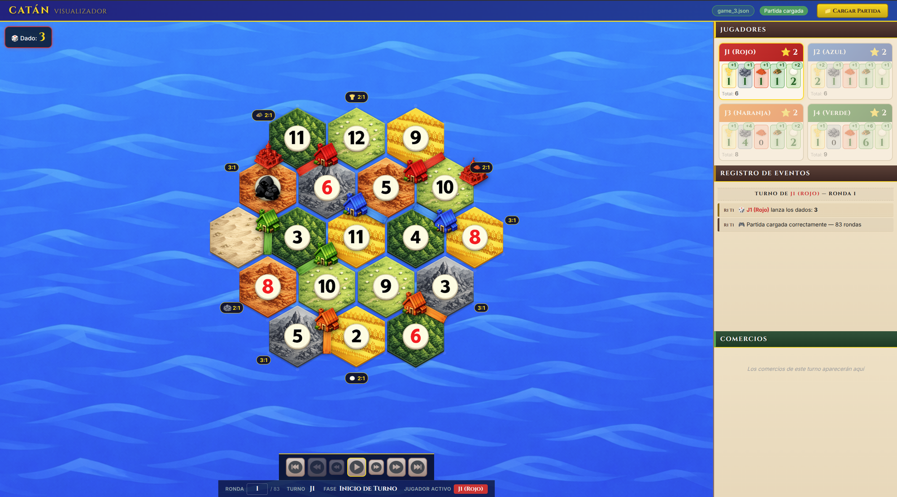

# PyCatan-Simulator

Simulador de Catan con agentes inteligentes para la asignatura de **Inteligencia Artificial** — Grado en Tecnologias Interactivas, Universitat Politecnica de Valencia.

## Estructura del proyecto

```
PyCatan-Simulator/
├── Agents/                    # Agentes inteligentes
│   ├── RandomAgent.py         # Agente aleatorio (base)
│   ├── AdrianHerasAgent.py    # Agente estandar
│   ├── AlexPastorAgent.py     # Agente estandar
│   └── ...                    # Otros agentes de estudiantes
├── Classes/                   # Clases del juego
│   ├── Board.py               # Tablero
│   ├── Materials.py           # Materiales
│   ├── Hand.py                # Mano del jugador
│   ├── DevelopmentCards.py    # Cartas de desarrollo
│   ├── TradeOffer.py          # Ofertas de comercio
│   └── Constants.py           # Constantes del juego
├── Managers/                  # Logica del juego
│   ├── GameDirector.py        # Director de partida
│   ├── GameManager.py         # Motor del juego
│   ├── AgentManager.py        # Gestion de agentes
│   ├── CommerceManager.py     # Comercio
│   └── TurnManager.py         # Turnos
├── Interfaces/
│   └── AgentInterface.py      # Interfaz base del agente
├── TraceLoader/
│   └── TraceLoader.py         # Exportador de trazas JSON
├── Game/                      # Visualizador web
│   ├── index.html
│   ├── game.js
│   └── styles.css
├── nuevos_assets/             # Imagenes del visualizador
├── run_execution.py           # Ejecutar partidas en lote
├── main.py                    # Punto de entrada interactivo
└── README.md
```

## Requisitos

- Python 3.10+
- No requiere dependencias externas para el simulador base

## Uso rapido

### Ejecutar una partida interactiva
```bash
python main.py
```

### Generar una traza con agentes especificos
```python
from Managers.GameDirector import GameDirector
from Agents.AdrianHerasAgent import AdrianHerasAgent
from Agents.RandomAgent import RandomAgent

gd = GameDirector(
    agents=[AdrianHerasAgent, RandomAgent, RandomAgent, RandomAgent],
    max_rounds=200,
    store_trace=True
)
gd.game_start(game_number=0, print_outcome=True)
```

### Visualizar una partida
Abre `Game/index.html` en un navegador y carga un archivo `.json` generado por el simulador.

## Visualizador



El visualizador permite reproducir partidas paso a paso con controles de navegacion:

- Avance/retroceso por fase, turno o ronda
- Salto directo a cualquier ronda
- Panel de jugadores con recursos en tiempo real
- Registro de eventos y comercios
- Indicadores de cambio de recursos (+/-) persistentes

## Reglas implementadas

- 4 jugadores, tablero estandar de Catan (19 hexagonos)
- Distribucion de recursos por tirada de dados
- Comercio entre jugadores y con puerto/banca (4:1, 3:1, 2:1)
- Construccion de carreteras, poblados y ciudades
- Cartas de desarrollo (caballero, monopolio, dos caminos, abundancia, punto de victoria)
- Ladron al sacar 7 (descarte de la mitad, robo a jugador adyacente)
- Condicion de victoria: 10 puntos

## Licencia

Proyecto academico — UPV 2026
